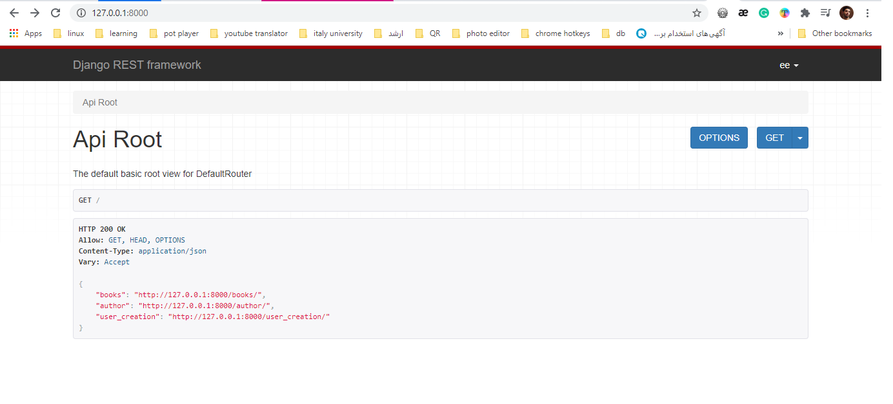
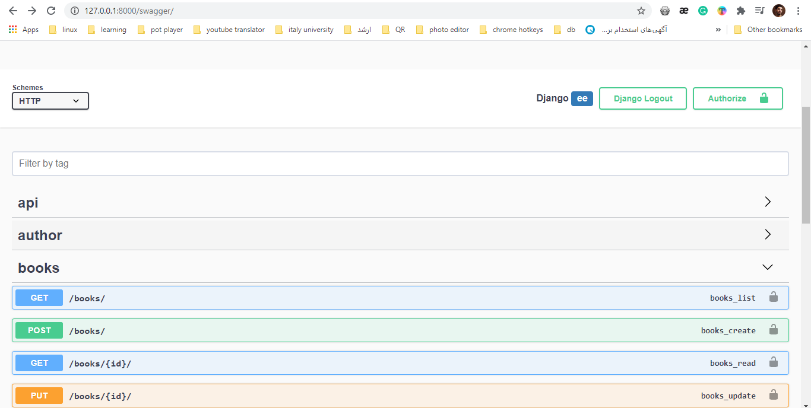
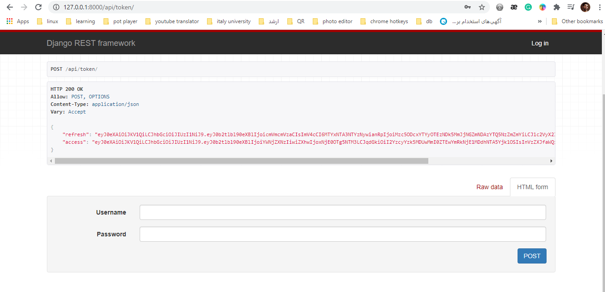
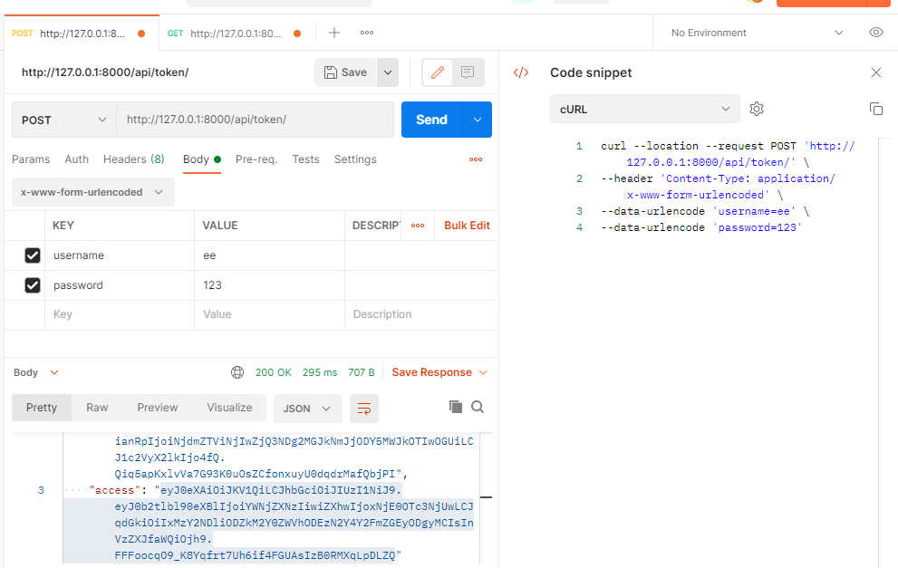

to test django fast you can use
```
pip install django-extensions
```
add this to your django setting app
```django
INSTALLED_APPS = (
    ...
    'django_extensions',
)
```
```
python manage.py shell_plus --notebook
```
# django_rest_challenge
## this app is full-featured basic Django REST API with below features

* class-based
* jwt_Authentication
* drf-yasg(swagger)
* user serializer
* model unit test 

#### _future features:_
* API unit tests

this django app provide API for authenticated users to _get_  _create_ _delete_ _edit_ books and adminusers can create 
new user and auther 


## Installation
clone (https://gitlab.com/nmzistg/django_rest_challenge) repo


#### install requirments
```bash
pip install -r requirements.txt
```
**in some scared cases you need install `djangorestframework-simplejwt` manually
beside of it some new `PyJWT` versions are buggy just use recommanded version in requirment.text**
```bash
djangorestframework-simplejwt==4.4.0
PyJWT==1.7.1
```
for migrations database in terminal run
```bash
python manage.py makemigrations

python manage.py migrate
```
go to project directory and
run the server with 
```bash
python manage.py runserver
```
for creating superuser
```bash
python manage.py creatsuperuser
```
and choose your username and pass

##### open your browsers by defal it runs on (http://127.0.0.1:8000)


### for using swagger
http://127.0.0.1:8000/swagger/


### getting token url
http://127.0.0.1:8000/api/token



### you can use postman 
#### specify your *username* and *password* and click send to get your token 


#### then open another request in Auth tab choose Bearar token and pate your token 

